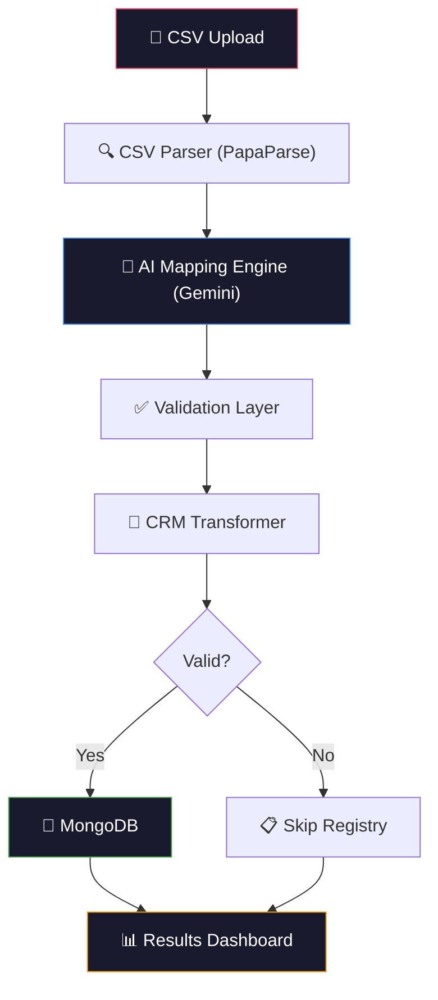
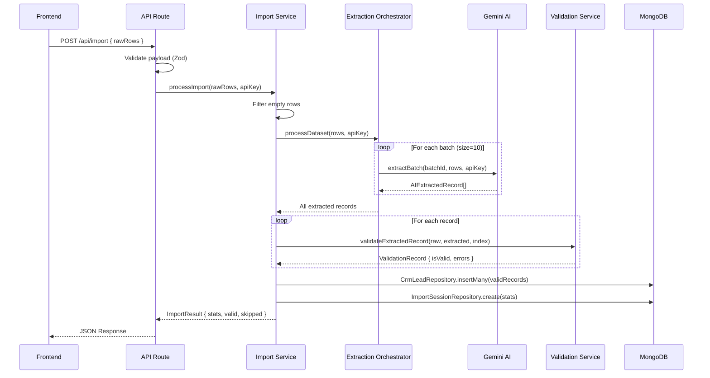
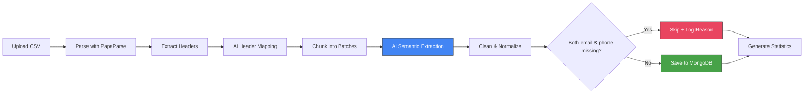

Test File- [https://drive.google.com/drive/u/0/home](https://drive.google.com/file/d/1q3fhR0Tk4RVXOIV1tUWKy__r-8GUzBBe/view?usp=sharing)
https://drive.google.com/file/d/1hH87oa7_wwOoAvdtys3RR4WJP1i6JUAM/view?usp=sharing


<p align="center">
  
  
  
  
  
</p>

# GrowEasy — AI-Powered CSV Importer

> An intelligent CSV importer that leverages LLM-powered semantic extraction to convert arbitrary lead datasets into standardized CRM records — regardless of column names, ordering, or data formatting.

---

## Table of Contents

- [Project Overview](#project-overview)
- [Features](#features)
- [Architecture](#architecture)
- [Folder Structure](#folder-structure)
- [Tech Stack](#tech-stack)
- [Database Schema](#database-schema)
- [API Documentation](#api-documentation)
- [Installation](#installation)
- [Environment Variables](#environment-variables)
- [Example CSV](#example-csv)
- [Screenshots](#screenshots)
- [Performance Optimizations](#performance-optimizations)
- [Security Considerations](#security-considerations)
- [Scalability](#scalability)
- [Future Improvements](#future-improvements)
- [Author](#author)
- [License](#license)

---

## Project Overview

### The Problem

Traditional CSV importers rely on rigid column-name matching. If a user uploads a file with `"Mail ID"` instead of `"Email"`, or `"Contact Number"` instead of `"Phone"`, the import fails. This creates friction in real-world CRM workflows where lead data arrives in dozens of incompatible formats from different vendors, forms, and scrapers.

### Why Traditional Importers Fail

- **Column names are never consistent.** One vendor calls it `"Full Name"`, another uses `"Name"`, a third splits it into `"First Name"` and `"Last Name"`.
- **Data is messy.** Phone numbers come with country codes, dashes, parentheses, or spaces. Emails are mixed in with notes.
- **Manual mapping does not scale.** Asking users to manually map 15+ columns every time they import a file is a poor user experience.

### The AI-Based Solution

GrowEasy uses **Google Gemini** to semantically understand the _intent_ of each CSV column — not just its header text. The AI reads sample data, infers which CRM field each column maps to, and extracts normalized values from every row. This means a CSV with columns named in Hindi, abbreviated, or completely unconventional will still import correctly.

### Assignment Objective

This project was built as a submission for the **GrowEasy Software Developer Assignment** — to demonstrate an AI-powered CSV import pipeline that can handle any valid CSV format and produce standardized CRM lead records.

---

## Features

| Category | Feature | Description |
|---|---|---|
| 🤖 AI | **Semantic Header Mapping** | Gemini AI analyzes CSV headers and sample data to infer CRM field mappings |
| 🤖 AI | **Batch Field Extraction** | Raw rows are processed in configurable batches with automatic retry logic |
| 📄 CSV | **Universal CSV Support** | Handles any column names, ordering, delimiters, and encoding |
| 🔧 Normalization | **Phone Normalization** | Strips country codes, dashes, spaces, and brackets from phone numbers |
| 🔧 Normalization | **Email Validation** | RFC-compliant email cleaning and deduplication |
| 🔧 Normalization | **Enum Enforcement** | `crm_status` and `data_source` are validated against strict enumerated values |
| ✅ Validation | **Intelligent Skip Logic** | Records are only skipped when _both_ email and phone are missing |
| 📊 Analytics | **Import Statistics** | Real-time success rate, imported count, and skipped count with reasons |
| 💾 Database | **MongoDB Persistence** | Valid records and import session metadata are persisted to MongoDB |
| 🎨 UI | **Responsive SaaS Interface** | Clean, tabbed results dashboard with imported/skipped record views |
| 🛡️ Reliability | **Error Isolation** | AI failures, DB failures, and validation failures are handled independently |
| ⚡ Performance | **Chunked Processing** | Large datasets are split into batches to respect API rate limits |

---

## Architecture

### High-Level Architecture



### Backend Request Flow



### AI Processing Pipeline



---

## Folder Structure

```
groweasy/
├── app/                              # Next.js App Router
│   ├── api/
│   │   ├── import/route.ts           # POST /api/import — AI extraction + persistence
│   │   └── map/route.ts              # POST /api/map — AI header mapping
│   ├── page.tsx                      # Main application page
│   ├── layout.tsx                    # Root layout with metadata
│   └── globals.css                   # Global styles and design tokens
│
├── src/
│   ├── components/
│   │   ├── features/                 # Domain-specific components
│   │   │   ├── file-upload.tsx       # Drag-and-drop CSV upload with validation
│   │   │   ├── csv-preview.tsx       # Parsed CSV data preview table
│   │   │   ├── processing-state.tsx  # AI processing loading state
│   │   │   ├── import-results.tsx    # Tabbed import results (imported/skipped)
│   │   │   └── data-table.tsx        # Reusable data table renderer
│   │   ├── layout/                   # Structural layout components
│   │   │   ├── header.tsx            # Application header
│   │   │   ├── page-shell.tsx        # Page container wrapper
│   │   │   ├── page-title.tsx        # Page title component
│   │   │   └── section.tsx           # Content section wrapper
│   │   └── ui/                       # Primitive UI components
│   │       ├── badge.tsx             # Status badge
│   │       ├── button.tsx            # Button with variants
│   │       ├── card.tsx              # Card container
│   │       ├── divider.tsx           # Visual divider
│   │       ├── input.tsx             # Form input
│   │       ├── skeleton.tsx          # Loading skeleton
│   │       └── states.tsx            # Empty/error state placeholders
│   │
│   ├── core/
│   │   ├── constants/crm.ts          # CRM schema, AI prompts, batch config
│   │   └── types/crm.ts             # TypeScript interfaces and Zod enums
│   │
│   ├── hooks/
│   │   └── use-import-flow.ts        # React hook managing the import state machine
│   │
│   ├── lib/
│   │   ├── ai/
│   │   │   ├── provider.ts           # IAIMappingProvider interface (abstraction)
│   │   │   ├── gemini.provider.ts    # Gemini API implementation
│   │   │   ├── mock.provider.ts      # Mock provider for testing
│   │   │   └── extractor.ts          # AI batch extraction service
│   │   ├── api/
│   │   │   └── client.ts             # Frontend API client
│   │   ├── csv/
│   │   │   └── parser.ts             # PapaParse CSV parsing wrapper
│   │   ├── db/
│   │   │   ├── mongoose.ts           # MongoDB connection singleton
│   │   │   ├── models/
│   │   │   │   ├── CrmLead.ts        # Mongoose schema for CRM leads
│   │   │   │   └── ImportSession.ts  # Mongoose schema for import sessions
│   │   │   └── repositories/
│   │   │       ├── crm-lead.repository.ts       # CRM lead data access
│   │   │       └── import-session.repository.ts # Session data access
│   │   ├── logger/
│   │   │   └── logger.ts             # Structured JSON logger
│   │   └── utils/
│   │       ├── batch.ts              # chunkArray + withRetry utilities
│   │       ├── cleaners.ts           # Phone, email, date normalization
│   │       └── cn.ts                 # Tailwind class merge utility
│   │
│   └── services/
│       ├── import.service.ts          # Import orchestration (extraction → validation → persistence)
│       ├── extraction.orchestrator.ts # Batched AI extraction with retry
│       ├── mapping.service.ts         # Header-to-CRM field mapping
│       └── validation.service.ts      # Record validation and normalization
│
├── .env.example                       # Environment variable template
├── package.json
├── tsconfig.json
└── next.config.ts
```

---

## Tech Stack

### Frontend

| Technology | Purpose |
|---|---|
| [Next.js 16](https://nextjs.org/) | React framework with App Router and Turbopack |
| [React 19](https://react.dev/) | UI component library |
| [TypeScript 5](https://www.typescriptlang.org/) | Static type safety across the entire codebase |
| [Tailwind CSS 4](https://tailwindcss.com/) | Utility-first styling |
| [Lucide React](https://lucide.dev/) | Icon library |

### Backend

| Technology | Purpose |
|---|---|
| [Next.js API Routes](https://nextjs.org/docs/app/building-your-application/routing/route-handlers) | Serverless API endpoints |
| [Zod 4](https://zod.dev/) | Runtime request validation and schema parsing |
| [PapaParse](https://www.papaparse.com/) | High-performance CSV parsing |

### AI

| Technology | Purpose |
|---|---|
| [Google Gemini API](https://ai.google.dev/) | LLM-powered semantic extraction and header mapping |
| Provider Abstraction (`IAIMappingProvider`) | Swap between Gemini, Mock, or future providers without code changes |

### Database

| Technology | Purpose |
|---|---|
| [MongoDB](https://www.mongodb.com/) | Document database for CRM lead storage |
| [Mongoose 9](https://mongoosejs.com/) | ODM with schema validation and connection pooling |

### Deployment

| Technology | Purpose |
|---|---|
| [Vercel](https://vercel.com/) | Edge-optimized hosting with automatic CI/CD |

### Developer Experience

| Technology | Purpose |
|---|---|
| [ESLint 9](https://eslint.org/) | Code quality enforcement |
| [Turbopack](https://turbo.build/pack) | Sub-second hot module replacement in development |

---

## Database Schema

### CRM Lead Model

Stores each successfully imported lead record.

| Field | Type | Required | Description |
|---|---|---|---|
| `created_at` | `String` | No | Original timestamp from the CSV |
| `name` | `String` | No | Full name of the lead |
| `email` | `String` | No | Primary email address (cleaned) |
| `country_code` | `String` | No | Phone country code (e.g., `"91"`) |
| `mobile_without_country_code` | `String` | No | Local phone digits only |
| `company` | `String` | No | Company or organization |
| `city` | `String` | No | City |
| `state` | `String` | No | State or province |
| `country` | `String` | No | Country |
| `lead_owner` | `String` | No | Assigned lead owner |
| `crm_status` | `String` | No | One of: `GOOD_LEAD_FOLLOW_UP`, `DID_NOT_CONNECT`, `BAD_LEAD`, `SALE_DONE` |
| `crm_note` | `String` | No | Notes, remarks, and overflow contact info |
| `data_source` | `String` | No | One of: `leads_on_demand`, `meridian_tower`, `eden_park`, `varah_swamy`, `sarjapur_plots` |
| `possession_time` | `String` | No | Expected possession timeline |
| `description` | `String` | No | Additional details |
| `extra_emails` | `[String]` | No | Additional email addresses found in the row |
| `extra_phones` | `[String]` | No | Additional phone numbers found in the row |
| `importSessionId` | `ObjectId` | No | Reference to the parent import session |
| `createdAt` | `Date` | Auto | Mongoose auto-generated timestamp |
| `updatedAt` | `Date` | Auto | Mongoose auto-generated timestamp |

### Import Session Model

Stores metadata for each import operation.

| Field | Type | Required | Description |
|---|---|---|---|
| `sessionName` | `String` | Yes | Auto-generated session identifier |
| `totalRecords` | `Number` | Yes | Total records processed |
| `importedCount` | `Number` | Yes | Records successfully imported |
| `skippedCount` | `Number` | Yes | Records that failed validation |
| `successRate` | `Number` | Yes | Percentage of successful imports |
| `createdAt` | `Date` | Auto | Mongoose auto-generated timestamp |
| `updatedAt` | `Date` | Auto | Mongoose auto-generated timestamp |

---

## API Documentation

### `POST /api/map`

Maps CSV headers to CRM schema fields using AI.

**Request**

```json
{
  "headers": ["Full Name", "Contact Number", "Mail ID", "Remarks"],
  "sampleRows": [
    {
      "Full Name": "Rahul Sharma",
      "Contact Number": "+91-9876543210",
      "Mail ID": "rahul@example.com",
      "Remarks": "Interested in 2BHK"
    }
  ],
  "provider": "gemini"
}
```

**Response**

```json
{
  "success": true,
  "data": [
    { "crmFieldKey": "name", "csvHeader": "Full Name" },
    { "crmFieldKey": "mobile_without_country_code", "csvHeader": "Contact Number" },
    { "crmFieldKey": "email", "csvHeader": "Mail ID" },
    { "crmFieldKey": "notes", "csvHeader": "Remarks" }
  ]
}
```

---

### `POST /api/import`

Processes raw CSV rows through the AI extraction pipeline and persists results to MongoDB.

**Request**

```json
{
  "rawRows": [
    {
      "Full Name": "Rahul Sharma",
      "Contact Number": "+91-9876543210",
      "Mail ID": "rahul@example.com",
      "Remarks": "Interested in 2BHK"
    },
    {
      "Full Name": "Priya Patel",
      "Contact Number": "",
      "Mail ID": "",
      "Remarks": "No contact info"
    }
  ]
}
```

**Response**

```json
{
  "success": true,
  "data": {
    "stats": {
      "totalRecords": 2,
      "importedCount": 1,
      "skippedCount": 1,
      "successRate": 50
    },
    "validRecords": [
      {
        "index": 0,
        "originalData": { "Full Name": "Rahul Sharma", "...": "..." },
        "extractedData": { "name": "Rahul Sharma", "email": "rahul@example.com", "...": "..." },
        "normalizedData": { "name": "Rahul Sharma", "email": "rahul@example.com", "...": "..." },
        "isValid": true,
        "errors": []
      }
    ],
    "skippedRecords": [
      {
        "index": 1,
        "originalData": { "Full Name": "Priya Patel", "...": "..." },
        "isValid": false,
        "errors": ["Record skipped: Both mobile number and email are missing or invalid."]
      }
    ]
  }
}
```

**Validation Rules**

| Rule | Behavior |
|---|---|
| Both email and phone missing | Record is **skipped** |
| Only email present | Record is **imported** ✅ |
| Only phone present | Record is **imported** ✅ |
| Both email and phone present | Record is **imported** ✅ |
| `crm_status` not in enum | Field set to `null`, record still imported |
| `data_source` not in enum | Field set to `""`, record still imported |
| AI extraction returns null | Record is **skipped** with error message |

---

## Installation

### Prerequisites

- **Node.js** ≥ 18.0
- **MongoDB** (local instance or [MongoDB Atlas](https://www.mongodb.com/atlas))
- **Gemini API Key** ([Get one here](https://aistudio.google.com/apikey))

### Setup

```bash
# 1. Clone the repository
git clone https://github.com/souma9830/GrowEasy.git
cd GrowEasy/groweasy

# 2. Install dependencies
npm install

# 3. Configure environment variables
cp .env.example .env
# Edit .env with your actual values (see Environment Variables section below)

# 4. Start the development server
npm run dev
```

The application will be available at **http://localhost:3000**.

### Production Build

```bash
npm run build
npm start
```

---

## Environment Variables

Create a `.env` file in the project root using `.env.example` as a template.

| Variable | Description | Required |
|---|---|---|
| `GEMINI_API_KEY` | Google Gemini API key for AI-powered extraction | ✅ Yes |
| `MONGODB_URI` | MongoDB connection string (e.g., `mongodb://localhost:27017/groweasy`) | ✅ Yes |

> **Security Note:** Never commit your `.env` file. The `.gitignore` is pre-configured to exclude it.

---

## Example CSV

The importer is designed to handle any CSV structure. Here are examples of formats that all work correctly:

**Format A — Standard CRM export**
```csv
Name,Email,Phone,Company,Status
Rahul Sharma,rahul@example.com,+91-9876543210,Acme Corp,Interested
Priya Patel,priya@example.com,,TechStart,Follow up
```

**Format B — Google Forms export**
```csv
Timestamp,Full Name,Email Address,Contact Number,Remarks
5/13/2026 14:20:48,Rahul Sharma,rahul@example.com,9876543210,Interested in 2BHK
5/14/2026 09:15:33,Priya Patel,priya@example.com,,Call back later
```

**Format C — Unconventional headers**
```csv
Lead Person,Mail ID,WhatsApp Number,Notes,Source
Rahul Sharma,rahul@example.com,+919876543210,Good lead,Facebook
Priya Patel,priya@example.com,,"No answer",Website
```

All three formats produce identical normalized CRM output.

---

## Screenshots

> Screenshots can be added after deployment. Placeholder sections for visual documentation:

| Screen | Description |
|---|---|
| **Upload Screen** | Drag-and-drop file upload with CSV format validation |
| **CSV Preview** | Parsed data table showing raw CSV content before processing |
| **Processing State** | Animated loading indicator during AI extraction |
| **Import Results** | Tabbed dashboard showing imported records, skipped records, and statistics |

---

## Performance Optimizations

| Optimization | Implementation |
|---|---|
| **Batch Processing** | Large datasets are split into configurable chunks (`BATCH_SIZE = 10`) to prevent API timeouts and respect rate limits |
| **Automatic Retries** | Failed AI batches are retried up to `MAX_RETRIES = 3` times with the `withRetry` utility |
| **Index Alignment** | Failed batches insert `null` placeholders to maintain 1:1 row alignment, preventing data corruption |
| **Provider Abstraction** | The `IAIMappingProvider` interface allows swapping AI backends without modifying business logic |
| **Connection Pooling** | Mongoose maintains a singleton connection pool, reused across serverless function invocations |
| **Empty Row Filtering** | Completely empty CSV rows are pre-filtered before AI processing to reduce unnecessary API calls |
| **Minimal Re-renders** | The `useImportFlow` hook manages the import state machine, preventing unnecessary React re-renders |

---

## Security Considerations

| Concern | Mitigation |
|---|---|
| **API Key Exposure** | Gemini API key is stored server-side in `.env` and never sent to the client. All AI calls are made from API routes. |
| **Input Validation** | All API requests are validated at the boundary using Zod schemas before any processing occurs |
| **Payload Sanitization** | CSV data is parsed with PapaParse (which handles injection vectors) and validated before AI submission |
| **Output Validation** | AI-extracted enum values (`crm_status`, `data_source`) are validated against strict Zod enums |
| **Error Isolation** | Database failures do not prevent the API from returning import results to the client |
| **Dependency Audit** | Production dependencies are minimal and well-maintained (Next.js, Mongoose, Zod, PapaParse) |

---

## Scalability

The architecture is designed with clear separation of concerns to support future scaling:

| Dimension | Current | Scalable Path |
|---|---|---|
| **AI Providers** | Gemini | Add Anthropic, OpenAI, or local models via the `IAIMappingProvider` interface |
| **CRM Targets** | Single schema | Define additional schemas in `core/constants/` and add transformation layers |
| **Record Volume** | Synchronous batches | Introduce a job queue (BullMQ, AWS SQS) with background workers |
| **Database** | Single MongoDB | Shard collections by `importSessionId` or migrate to a time-series optimized store |
| **File Size** | In-memory parsing | Stream large files with chunked uploads and server-side streaming parsers |
| **Concurrency** | Sequential batches | Add a worker pool with configurable concurrency limits per API key |

---

## Future Improvements

- [ ] **Streaming Imports** — Process large files (100K+ rows) with chunked streaming instead of loading into memory
- [ ] **Background Jobs** — Move AI extraction to a background worker queue for non-blocking imports
- [ ] **WebSocket Progress** — Real-time progress updates during long-running imports
- [ ] **Multiple CRM Exports** — Export to Salesforce, HubSpot, or Zoho CRM in addition to the built-in schema
- [ ] **Import History** — Dashboard showing past import sessions with filtering and search
- [ ] **Duplicate Detection** — Identify and merge duplicate leads based on email or phone
- [ ] **Column Mapping Review** — Allow users to review and correct AI-suggested mappings before import
- [ ] **Rate Limit Handling** — Intelligent backoff with per-model quota tracking

---

## Author

**Soumadeep**

- GitHub: [@souma9830](https://github.com/souma9830)

---

## License

This project is licensed under the **MIT License**.

```
MIT License

Copyright (c) 2026 Soumadeep

Permission is hereby granted, free of charge, to any person obtaining a copy
of this software and associated documentation files (the "Software"), to deal
in the Software without restriction, including without limitation the rights
to use, copy, modify, merge, publish, distribute, sublicense, and/or sell
copies of the Software, and to permit persons to whom the Software is
furnished to do so, subject to the following conditions:

The above copyright notice and this permission notice shall be included in all
copies or substantial portions of the Software.

THE SOFTWARE IS PROVIDED "AS IS", WITHOUT WARRANTY OF ANY KIND, EXPRESS OR
IMPLIED, INCLUDING BUT NOT LIMITED TO THE WARRANTIES OF MERCHANTABILITY,
FITNESS FOR A PARTICULAR PURPOSE AND NONINFRINGEMENT. IN NO EVENT SHALL THE
AUTHORS OR COPYRIGHT HOLDERS BE LIABLE FOR ANY CLAIM, DAMAGES OR OTHER
LIABILITY, WHETHER IN AN ACTION OF CONTRACT, TORT OR OTHERWISE, ARISING FROM,
OUT OF OR IN CONNECTION WITH THE SOFTWARE OR THE USE OR OTHER DEALINGS IN THE
SOFTWARE.
```
