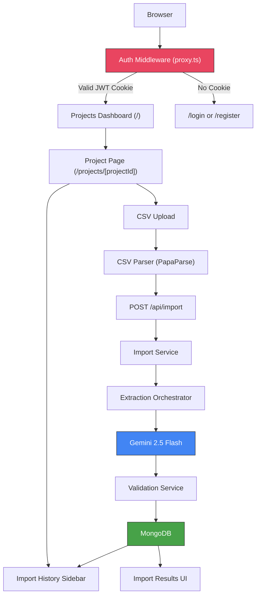
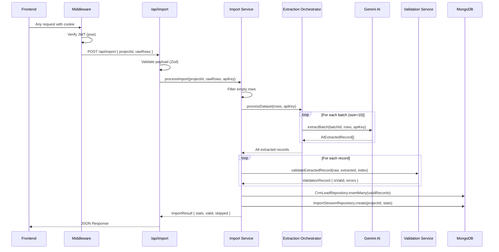

Test Files:
- https://drive.google.com/file/d/1q3fhR0Tk4RVXOIV1tUWKy__r-8GUzBBe/view?usp=sharing
- https://drive.google.com/file/d/1hH87oa7_wwOoAvdtys3RR4WJP1i6JUAM/view?usp=sharing


<p align="center">
  
  
  
  
  
  
</p>

# GrowEasy — AI-Powered CSV Importer

> An intelligent CSV importer that leverages LLM-powered semantic extraction to convert arbitrary lead datasets into standardized CRM records — regardless of column names, ordering, or data formatting. Organized around project workspaces with per-user authentication and full import history.

---

## Table of Contents

- [Project Overview](#project-overview)
- [Features](#features)
- [Architecture](#architecture)
- [User Flow](#user-flow)
- [Folder Structure](#folder-structure)
- [Tech Stack](#tech-stack)
- [Database Schema](#database-schema)
- [API Documentation](#api-documentation)
- [Installation](#installation)
- [Environment Variables](#environment-variables)
- [Example CSV](#example-csv)
- [Performance Optimizations](#performance-optimizations)
- [Security Considerations](#security-considerations)
- [Scalability](#scalability)
- [Author](#author)
- [License](#license)

---

## Project Overview

### The Problem

Traditional CSV importers rely on rigid column-name matching. If a user uploads a file with `"Mail ID"` instead of `"Email"`, or `"Contact Number"` instead of `"Phone"`, the import fails. This creates friction in real-world CRM workflows where lead data arrives in dozens of incompatible formats from different vendors, forms, and scrapers.

### Why Traditional Importers Fail

- **Column names are never consistent.** One vendor calls it `"Full Name"`, another uses `"Name"`, a third splits it into `"First Name"` and `"Last Name"`.
- **Data is messy.** Phone numbers come with country codes, dashes, parentheses, or spaces. Emails are mixed in with notes.
- **Manual mapping does not scale.** Asking users to manually map 15+ columns every time they import a file is a poor user experience.
- **No organizational structure.** Flat import flows lack the concept of projects or workspaces, making it difficult to track which leads came from which campaign or source.

### The AI-Based Solution

GrowEasy uses **Google Gemini 2.5 Flash** to semantically understand the intent of each CSV column — not just its header text. The AI reads sample data, infers which CRM field each column maps to, and extracts normalized values from every row. This means a CSV with columns named in Hindi, abbreviated, or completely unconventional will still import correctly.

Project workspaces allow users to group imports logically. Every import is associated with a project, and the full import history is accessible from the project sidebar — all stored in MongoDB, with no external file storage required.

### Assignment Objective

This project was built as a submission for the **GrowEasy Software Developer Assignment** — to demonstrate an AI-powered CSV import pipeline that can handle any valid CSV format and produce standardized CRM lead records.

---

## Features

| Category | Feature | Description |
|---|---|---|
| Auth | User Registration | Create an account with name, email, and password. Passwords are hashed with bcrypt. |
| Auth | Session Management | JWT token stored in an httpOnly cookie. 7-day expiry. Server-side validation on every request via Next.js middleware. |
| Auth | Data Isolation | All projects and imports are scoped to the authenticated user. No user can see another user's data. |
| Workspace | Projects Dashboard | Landing page shows all projects belonging to the logged-in user. Create, open, and manage projects from one view. |
| Workspace | Project Sidebar | Each project page has a persistent left sidebar listing all previous imports with date, total records, and success count. |
| Workspace | Import Stats | Completing an import automatically increments the project's aggregate statistics. |
| AI | Semantic Header Mapping | Gemini AI analyzes CSV headers and sample data to infer CRM field mappings. |
| AI | Batch Field Extraction | Raw rows are processed in configurable batches with automatic retry logic. |
| CSV | Universal CSV Support | Handles any column names, ordering, delimiters, and encoding. |
| Normalization | Phone Normalization | Strips country codes, dashes, spaces, and brackets from phone numbers. |
| Normalization | Email Validation | RFC-compliant email cleaning and deduplication. |
| Normalization | Enum Enforcement | `crm_status` and `data_source` are validated against strict enumerated values. |
| Validation | Intelligent Skip Logic | Records are only skipped when both email and phone are missing. |
| Analytics | Import Statistics | Real-time success rate, imported count, and skipped count with reasons. |
| Database | MongoDB Persistence | Valid records, import sessions, projects, and users are persisted to MongoDB. |
| UI | Responsive SaaS Interface | Clean, dark-mode-capable results dashboard with imported and skipped record views. |
| Reliability | Error Isolation | AI failures, DB failures, and validation failures are handled independently. |
| Performance | Chunked Processing | Large datasets are split into batches to respect API rate limits. |

---

## Architecture

### High-Level Architecture



### Backend Request Flow



---

## User Flow

```
Register / Login
      |
      v
Projects Dashboard  -->  Create Project
      |
      v
Open Project
      |
      +--- Left Sidebar: Import History (previous uploads, dates, stats)
      |
      v
Upload CSV
      |
      v
Preview CSV
      |
      v
AI Extraction + Validation
      |
      v
Import Results  -->  Sidebar auto-refreshes with new session
```

---

## Folder Structure

```
groweasy/
├── middleware.ts                         # JWT auth guard — protects all routes except /login and /register
├── app/
│   ├── api/
│   │   ├── auth/
│   │   │   ├── login/route.ts            # POST /api/auth/login
│   │   │   ├── register/route.ts         # POST /api/auth/register
│   │   │   └── logout/route.ts           # POST /api/auth/logout
│   │   ├── import/route.ts               # POST /api/import — AI extraction + persistence
│   │   ├── map/route.ts                  # POST /api/map — AI header mapping
│   │   └── projects/
│   │       ├── route.ts                  # GET/POST /api/projects (user-scoped)
│   │       └── [projectId]/
│   │           ├── route.ts              # GET/PATCH/DELETE /api/projects/[projectId]
│   │           └── sessions/route.ts     # GET /api/projects/[projectId]/sessions
│   ├── login/page.tsx                    # Login page
│   ├── register/page.tsx                 # Registration page
│   ├── projects/
│   │   └── [projectId]/page.tsx          # Project import page with sidebar
│   ├── page.tsx                          # Projects dashboard
│   ├── layout.tsx                        # Root layout with metadata
│   └── globals.css                       # Global styles and design tokens
│
├── src/
│   ├── components/
│   │   ├── features/
│   │   │   ├── file-upload.tsx           # Drag-and-drop CSV upload
│   │   │   ├── csv-preview.tsx           # Parsed CSV data preview table
│   │   │   ├── processing-state.tsx      # AI processing loading state
│   │   │   ├── import-results.tsx        # Tabbed import results
│   │   │   ├── data-table.tsx            # Reusable data table with text-wrap support
│   │   │   ├── project-card.tsx          # Project card for dashboard grid
│   │   │   └── create-project-modal.tsx  # Modal for creating new projects
│   │   ├── layout/
│   │   │   ├── header.tsx                # Header with theme toggle and logout button
│   │   │   ├── project-sidebar.tsx       # Import history sidebar for project pages
│   │   │   ├── page-shell.tsx
│   │   │   ├── page-title.tsx
│   │   │   └── section.tsx
│   │   └── ui/
│   │       ├── badge.tsx
│   │       ├── button.tsx
│   │       ├── card.tsx
│   │       ├── divider.tsx
│   │       ├── input.tsx
│   │       ├── skeleton.tsx
│   │       └── states.tsx
│   │
│   ├── core/
│   │   ├── constants/crm.ts              # CRM schema, AI prompts, batch config
│   │   └── types/crm.ts                  # TypeScript interfaces and Zod enums
│   │
│   ├── hooks/
│   │   └── use-import-flow.ts            # React hook managing the import state machine
│   │
│   ├── lib/
│   │   ├── ai/
│   │   │   ├── provider.ts               # IAIMappingProvider interface
│   │   │   ├── gemini.provider.ts        # Gemini API implementation
│   │   │   ├── mock.provider.ts          # Mock provider for testing
│   │   │   └── extractor.ts              # AI batch extraction (no responseMimeType)
│   │   ├── api/
│   │   │   └── client.ts                 # Frontend API client
│   │   ├── auth/
│   │   │   ├── jwt.ts                    # jose-based JWT sign/verify
│   │   │   └── session.ts                # Server-side cookie reader helper
│   │   ├── csv/
│   │   │   └── parser.ts                 # PapaParse CSV parsing wrapper
│   │   ├── db/
│   │   │   ├── mongoose.ts               # MongoDB connection singleton
│   │   │   ├── models/
│   │   │   │   ├── User.ts               # User schema
│   │   │   │   ├── Project.ts            # Project schema (userId-scoped)
│   │   │   │   ├── CrmLead.ts            # CRM lead schema
│   │   │   │   └── ImportSession.ts      # Import session schema (projectId-linked)
│   │   │   └── repositories/
│   │   │       ├── crm-lead.repository.ts
│   │   │       └── import-session.repository.ts
│   │   ├── logger/
│   │   │   └── logger.ts                 # Structured JSON logger
│   │   └── utils/
│   │       ├── batch.ts                  # chunkArray + withRetry utilities
│   │       ├── cleaners.ts               # Phone, email, date normalization
│   │       └── cn.ts                     # Class name merge utility
│   │
│   └── services/
│       ├── import.service.ts             # Import orchestration
│       ├── extraction.orchestrator.ts    # Batched AI extraction with retry
│       ├── mapping.service.ts            # Header-to-CRM field mapping
│       └── validation.service.ts         # Record validation and normalization
│
├── .env.example
├── package.json
├── tsconfig.json
└── next.config.ts
```

---

## Tech Stack

### Frontend

| Technology | Purpose |
|---|---|
| [Next.js 16](https://nextjs.org/) | React framework with App Router and Turbopack |
| [React 19](https://react.dev/) | UI component library |
| [TypeScript 5](https://www.typescriptlang.org/) | Static type safety across the entire codebase |
| Vanilla CSS with Design Tokens | Custom design system — no utility-class framework dependency |
| [Lucide React](https://lucide.dev/) | Icon library |

### Backend

| Technology | Purpose |
|---|---|
| [Next.js API Routes](https://nextjs.org/docs/app/building-your-application/routing/route-handlers) | Serverless API endpoints |
| [Zod 4](https://zod.dev/) | Runtime request validation and schema parsing |
| [PapaParse](https://www.papaparse.com/) | High-performance CSV parsing |
| [bcryptjs](https://github.com/dcodeIO/bcrypt.js) | Password hashing |
| [jose](https://github.com/panva/jose) | Edge-compatible JWT signing and verification |

### AI

| Technology | Purpose |
|---|---|
| [Google Gemini 2.5 Flash](https://ai.google.dev/) | LLM-powered semantic extraction and header mapping |
| Provider Abstraction (`IAIMappingProvider`) | Swap between Gemini, Mock, or future providers without code changes |

### Database

| Technology | Purpose |
|---|---|
| [MongoDB](https://www.mongodb.com/) | Document database for users, projects, sessions, and CRM leads |
| [Mongoose 9](https://mongoosejs.com/) | ODM with schema validation and connection pooling |

### Deployment

| Technology | Purpose |
|---|---|
| [Vercel](https://vercel.com/) | Edge-optimized hosting with automatic CI/CD |

---

## Database Schema

### User Model

Stores registered user credentials.

| Field | Type | Required | Description |
|---|---|---|---|
| `name` | `String` | Yes | Full name of the user |
| `email` | `String` | Yes | Unique email address (lowercase) |
| `password` | `String` | Yes | bcrypt-hashed password |
| `createdAt` | `Date` | Auto | Mongoose auto-generated timestamp |

### Project Model

Stores project workspace metadata, scoped to a user.

| Field | Type | Required | Description |
|---|---|---|---|
| `userId` | `ObjectId` | Yes | Reference to the owning user |
| `project_name` | `String` | Yes | Display name of the project |
| `description` | `String` | No | Optional project description |
| `total_imports` | `Number` | No | Running count of imports in this project |
| `total_records` | `Number` | No | Total records processed across all imports |
| `imported_records` | `Number` | No | Total successfully imported records |
| `skipped_records` | `Number` | No | Total skipped records |
| `createdAt` | `Date` | Auto | Mongoose auto-generated timestamp |

### Import Session Model

Stores metadata for each individual import operation.

| Field | Type | Required | Description |
|---|---|---|---|
| `projectId` | `ObjectId` | Yes | Reference to the parent project |
| `sessionName` | `String` | Yes | Auto-generated session identifier |
| `totalRecords` | `Number` | Yes | Total records processed |
| `importedCount` | `Number` | Yes | Records successfully imported |
| `skippedCount` | `Number` | Yes | Records that failed validation |
| `successRate` | `Number` | Yes | Percentage of successful imports |
| `createdAt` | `Date` | Auto | Mongoose auto-generated timestamp |

### CRM Lead Model

Stores each successfully imported lead record.

| Field | Type | Required | Description |
|---|---|---|---|
| `created_at` | `String` | No | Original timestamp from the CSV |
| `name` | `String` | No | Full name of the lead |
| `email` | `String` | No | Primary email address (cleaned) |
| `country_code` | `String` | No | Phone country code (e.g., `"91"`) |
| `mobile_without_country_code` | `String` | No | Local phone digits only |
| `company` | `String` | No | Company or organization |
| `city` | `String` | No | City |
| `state` | `String` | No | State or province |
| `country` | `String` | No | Country |
| `lead_owner` | `String` | No | Assigned lead owner |
| `crm_status` | `String` | No | One of: `GOOD_LEAD_FOLLOW_UP`, `DID_NOT_CONNECT`, `BAD_LEAD`, `SALE_DONE` |
| `crm_note` | `String` | No | Notes, remarks, and overflow contact info |
| `data_source` | `String` | No | One of: `leads_on_demand`, `meridian_tower`, `eden_park`, `varah_swamy`, `sarjapur_plots` |
| `possession_time` | `String` | No | Expected possession timeline |
| `description` | `String` | No | Additional details |
| `extra_emails` | `[String]` | No | Additional email addresses found in the row |
| `extra_phones` | `[String]` | No | Additional phone numbers found in the row |
| `importSessionId` | `ObjectId` | No | Reference to the parent import session |
| `createdAt` | `Date` | Auto | Mongoose auto-generated timestamp |

---

## API Documentation

### `POST /api/auth/register`

Creates a new user account and sets a session cookie.

**Request**

```json
{
  "name": "Rahul Sharma",
  "email": "rahul@example.com",
  "password": "securepassword"
}
```

**Response**

```json
{
  "success": true,
  "user": { "name": "Rahul Sharma", "email": "rahul@example.com" }
}
```

Sets an `httpOnly` cookie `groweasy_token` containing a signed JWT.

---

### `POST /api/auth/login`

Authenticates an existing user and sets a session cookie.

**Request**

```json
{
  "email": "rahul@example.com",
  "password": "securepassword"
}
```

---

### `POST /api/auth/logout`

Clears the session cookie.

---

### `GET /api/projects`

Returns all projects belonging to the authenticated user, sorted by last update.

**Response**

```json
{
  "success": true,
  "data": [
    {
      "_id": "...",
      "project_name": "Facebook Leads Q2",
      "total_imports": 4,
      "total_records": 320,
      "imported_records": 298,
      "skipped_records": 22
    }
  ]
}
```

---

### `POST /api/projects`

Creates a new project under the authenticated user.

**Request**

```json
{
  "project_name": "Facebook Leads Q2",
  "description": "Leads from Meta campaign, July 2026"
}
```

---

### `GET /api/projects/[projectId]/sessions`

Returns all import sessions for a specific project, sorted newest first.

---

### `POST /api/import`

Processes raw CSV rows through the AI extraction pipeline and persists results to MongoDB.

**Request**

```json
{
  "projectId": "64ab1234...",
  "rawRows": [
    {
      "Full Name": "Rahul Sharma",
      "Contact Number": "+91-9876543210",
      "Mail ID": "rahul@example.com",
      "Remarks": "Interested in 2BHK"
    }
  ]
}
```

**Response**

```json
{
  "success": true,
  "data": {
    "stats": {
      "totalRecords": 1,
      "importedCount": 1,
      "skippedCount": 0,
      "successRate": 100
    },
    "validRecords": [...],
    "skippedRecords": []
  }
}
```

**Validation Rules**

| Rule | Behavior |
|---|---|
| Both email and phone missing | Record is skipped |
| Only email present | Record is imported |
| Only phone present | Record is imported |
| Both email and phone present | Record is imported |
| `crm_status` not in enum | Field set to `null`, record still imported |
| `data_source` not in enum | Field set to `""`, record still imported |
| AI extraction returns null | Record is skipped with error message |

---

## Installation

### Prerequisites

- **Node.js** >= 18.0
- **MongoDB** (local instance or [MongoDB Atlas](https://www.mongodb.com/atlas))
- **Gemini API Key** ([Get one here](https://aistudio.google.com/apikey))

### Setup

```bash
# 1. Clone the repository
git clone https://github.com/souma9830/GrowEasy.git
cd GrowEasy/groweasy

# 2. Install dependencies
npm install

# 3. Configure environment variables
cp .env.example .env
# Edit .env with your actual values

# 4. Start the development server
npm run dev
```

The application will be available at **http://localhost:3000**.

Open `/register` to create your first account. After registration you will be redirected to the Projects Dashboard.

### Production Build

```bash
npm run build
npm start
```

---

## Environment Variables

Create a `.env` file in the project root using `.env.example` as a template.

| Variable | Description | Required |
|---|---|---|
| `GEMINI_API_KEY` | Google Gemini API key for AI-powered extraction | Yes |
| `MONGODB_URI` | MongoDB connection string (e.g., `mongodb://localhost:27017/groweasy`) | Yes |
| `JWT_SECRET` | Secret key used to sign JWT tokens. Use a long random string in production. | Recommended |

> **Security note:** Never commit your `.env` file. The `.gitignore` is pre-configured to exclude it. If `JWT_SECRET` is not set, the application falls back to a hardcoded development key — always set this in production.

---

## Example CSV

The importer is designed to handle any CSV structure. Here are examples of formats that all work correctly:

**Format A — Standard CRM export**
```csv
Name,Email,Phone,Company,Status
Rahul Sharma,rahul@example.com,+91-9876543210,Acme Corp,Interested
Priya Patel,priya@example.com,,TechStart,Follow up
```

**Format B — Google Forms export**
```csv
Timestamp,Full Name,Email Address,Contact Number,Remarks
5/13/2026 14:20:48,Rahul Sharma,rahul@example.com,9876543210,Interested in 2BHK
5/14/2026 09:15:33,Priya Patel,priya@example.com,,Call back later
```

**Format C — Unconventional headers**
```csv
Lead Person,Mail ID,WhatsApp Number,Notes,Source
Rahul Sharma,rahul@example.com,+919876543210,Good lead,Facebook
Priya Patel,priya@example.com,,"No answer",Website
```

All three formats produce identical normalized CRM output.

---

## Performance Optimizations

| Optimization | Implementation |
|---|---|
| Batch Processing | Large datasets are split into configurable chunks (`BATCH_SIZE = 10`) to prevent API timeouts and respect rate limits |
| Automatic Retries | Failed AI batches are retried up to `MAX_RETRIES = 3` times with the `withRetry` utility |
| Index Alignment | Failed batches insert `null` placeholders to maintain 1:1 row alignment, preventing data corruption |
| Provider Abstraction | The `IAIMappingProvider` interface allows swapping AI backends without modifying business logic |
| Connection Pooling | Mongoose maintains a singleton connection pool, reused across serverless function invocations |
| Empty Row Filtering | Completely empty CSV rows are pre-filtered before AI processing to reduce unnecessary API calls |
| Minimal Re-renders | The `useImportFlow` hook manages the import state machine, preventing unnecessary React re-renders |
| Atomic Stats Updates | Project statistics use MongoDB `$inc` atomic operations to avoid race conditions during concurrent imports |

---

## Security Considerations

| Concern | Mitigation |
|---|---|
| Authentication | All application routes (pages and API endpoints) are protected by Next.js middleware that verifies a signed JWT stored in an httpOnly, SameSite cookie |
| Data Isolation | Projects and import sessions include a `userId` or `projectId` field. API routes verify ownership before returning or modifying data |
| Password Storage | User passwords are hashed with bcrypt (10 rounds) before storage. Plain-text passwords are never written to the database |
| API Key Exposure | Gemini API key is stored server-side in `.env` and never sent to the client. All AI calls are made from API routes |
| Input Validation | All API requests are validated at the boundary using Zod schemas before any processing occurs |
| Payload Sanitization | CSV data is parsed with PapaParse and validated before AI submission |
| Output Validation | AI-extracted enum values (`crm_status`, `data_source`) are validated against strict Zod enums |
| Error Isolation | Database failures do not prevent the API from returning import results to the client |

---

## Scalability

The architecture is designed with clear separation of concerns to support future scaling:

| Dimension | Current | Scalable Path |
|---|---|---|
| AI Providers | Gemini 2.5 Flash | Add Anthropic, OpenAI, or local models via the `IAIMappingProvider` interface |
| CRM Targets | Single schema | Define additional schemas in `core/constants/` and add transformation layers |
| Record Volume | Synchronous batches | Introduce a job queue (BullMQ, AWS SQS) with background workers |
| Database | Single MongoDB | Shard collections by `userId` or migrate to a time-series optimized store |
| File Size | In-memory parsing | Stream large files with chunked uploads and server-side streaming parsers |
| Concurrency | Sequential batches | Add a worker pool with configurable concurrency limits per API key |
| Multi-tenancy | Per-user isolation | Extend `userId` scoping to all collections; add team/organization layer above users |

---

## Author

**Soumadeep**

- GitHub: [@souma9830](https://github.com/souma9830)

---

## License

This project is licensed under the **MIT License**.

```
MIT License

Copyright (c) 2026 Soumadeep

Permission is hereby granted, free of charge, to any person obtaining a copy
of this software and associated documentation files (the "Software"), to deal
in the Software without restriction, including without limitation the rights
to use, copy, modify, merge, publish, distribute, sublicense, and/or sell
copies of the Software, and to permit persons to whom the Software is
furnished to do so, subject to the following conditions:

The above copyright notice and this permission notice shall be included in all
copies or substantial portions of the Software.

THE SOFTWARE IS PROVIDED "AS IS", WITHOUT WARRANTY OF ANY KIND, EXPRESS OR
IMPLIED, INCLUDING BUT NOT LIMITED TO THE WARRANTIES OF MERCHANTABILITY,
FITNESS FOR A PARTICULAR PURPOSE AND NONINFRINGEMENT. IN NO EVENT SHALL THE
AUTHORS OR COPYRIGHT HOLDERS BE LIABLE FOR ANY CLAIM, DAMAGES OR OTHER
LIABILITY, WHETHER IN AN ACTION OF CONTRACT, TORT OR OTHERWISE, ARISING FROM,
OUT OF OR IN CONNECTION WITH THE SOFTWARE OR THE USE OR OTHER DEALINGS IN THE
SOFTWARE.
```
